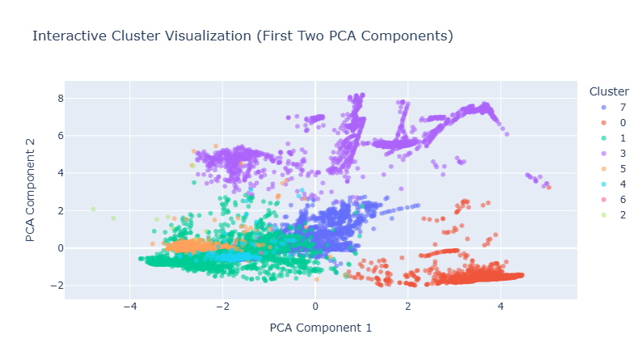
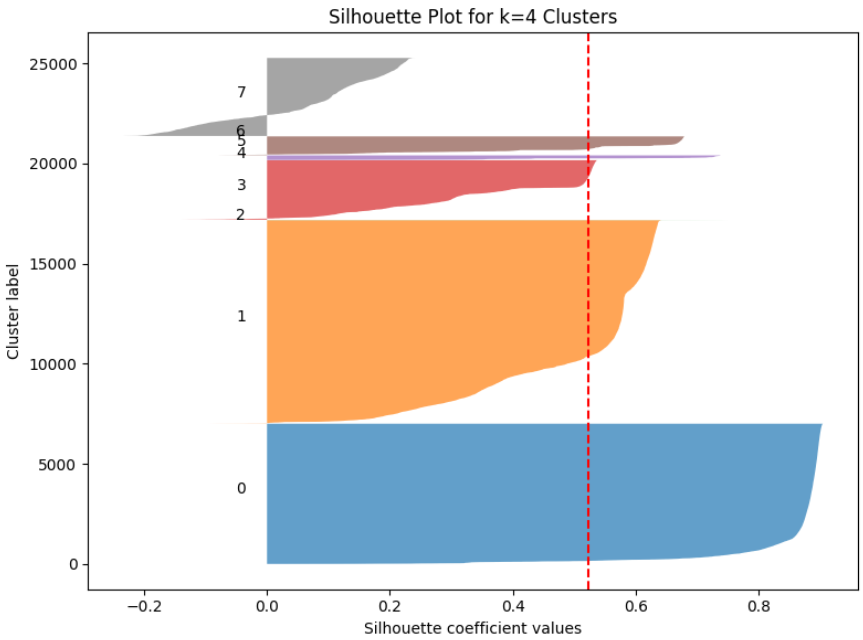
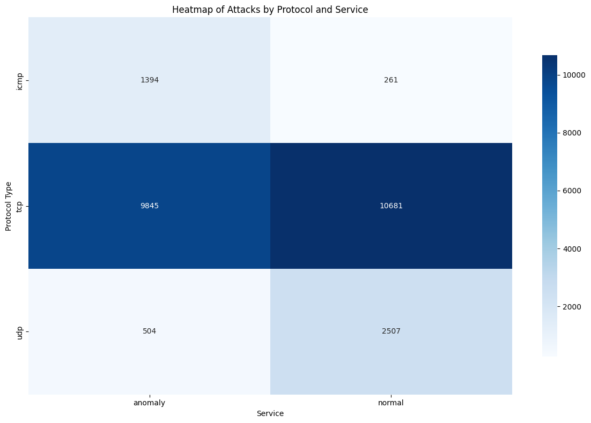
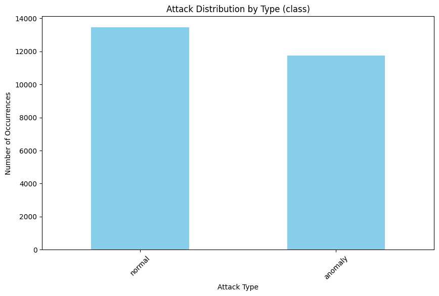
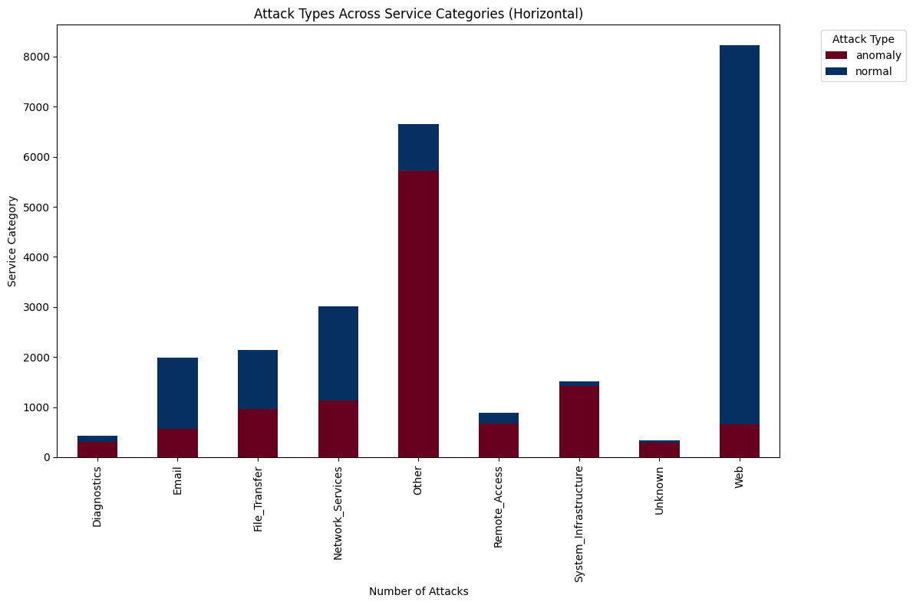
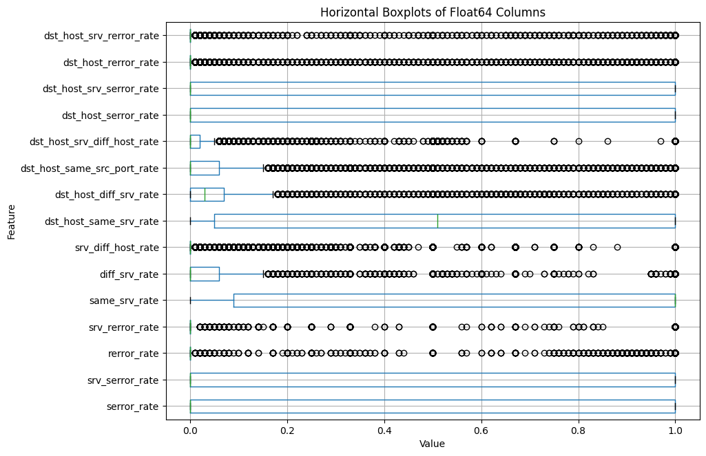
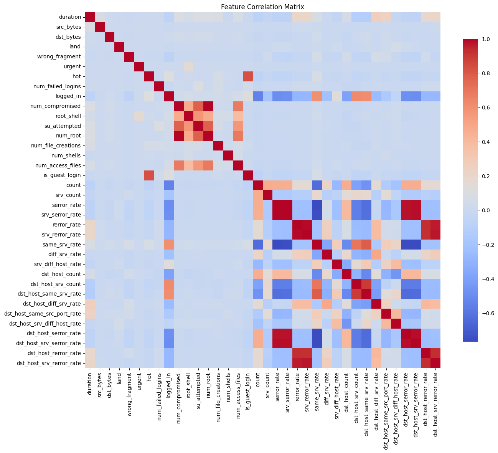
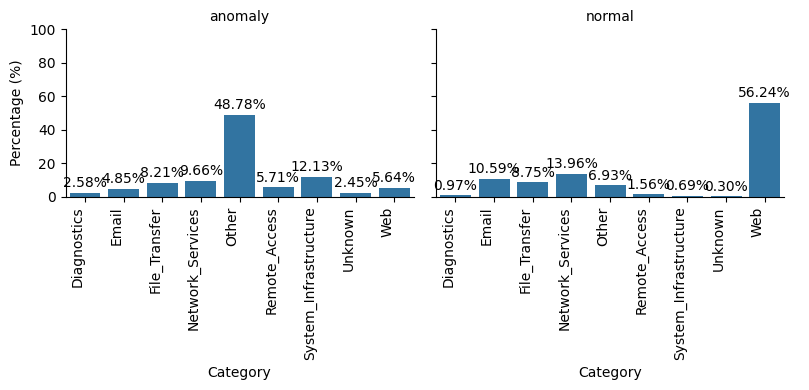

# Cybersecurity Threat Detection

**Cybersecurity Threat Detection** is a comprehensive data analysis project for the purpose of threat detection in network traffic, the project consists of a reusable ETL pipeline, exploratory analysis and a UI based threat detection tool based in Power BI 

# 

## Dataset Content

Link to the dataset: [Kaggle](https://www.kaggle.com/datasets/sampadab17/network-intrusion-detection).
Dataset consists of a wide variety of intrusions simulated in a military network environment. It has created an environment to acquire raw TCP/IP dump data for a network by simulating a typical US Air Force LAN. The LAN was focused like a real environment and blasted with multiple attacks. A connection is a sequence of TCP packets starting and ending at some time duration between which data flows to and from a source IP address to a target IP address under some well-defined protocol. Also, each connection is labelled as either normal or as an attack with exactly one specific attack type. Each connection record consists of about 100 bytes.
For each TCP/IP connection, 41 quantitative and qualitative features are obtained from normal and attack data (3 qualitative and 38 quantitative features) .The class variable has two categories: Normal and Anomalous

The following table describes all columns showing their type and meaning.
 
 | Column Name                   | Type         | Description                                                                 |
|-------------------------------|-------------|----------------------------------------------------------------------------|
| duration                      | numeric     | Length of the connection in seconds                                         |
| protocol_type                 | categorical | Type of protocol (TCP, UDP, ICMP)                                          |
| service                        | categorical | Network service on the destination (HTTP, FTP, SMTP, etc.)                 |
| flag                           | categorical | Status flag of the connection (SF, S0, REJ, etc.)                           |
| src_bytes                      | numeric     | Number of bytes sent from source to destination                             |
| dst_bytes                      | numeric     | Number of bytes sent from destination to source                             |
| land                           | binary      | 1 if connection is from/to the same host/port; 0 otherwise                  |
| wrong_fragment                 | numeric     | Number of wrong fragments in the connection                                 |
| urgent                         | numeric     | Number of urgent packets                                                    |
| hot                            | numeric     | Number of “hot” indicators (suspicious activities)                          |
| num_failed_logins              | numeric     | Number of failed login attempts                                             |
| logged_in                      | binary      | 1 if successfully logged in; 0 otherwise                                     |
| num_compromised                | numeric     | Number of compromised conditions in host                                     |
| root_shell                     | binary      | 1 if root shell obtained; 0 otherwise                                        |
| su_attempted                   | binary      | 1 if `su root` command attempted; 0 otherwise                                |
| num_root                       | numeric     | Number of root accesses                                                     |
| num_file_creations             | numeric     | Number of file creation operations                                          |
| num_shells                     | numeric     | Number of shell prompts invoked                                             |
| num_access_files               | numeric     | Number of operations on access control files                                |
| is_guest_login                 | binary      | 1 if login is a guest login; 0 otherwise                                     |
| count                          | numeric     | Number of connections to the same host as the current connection in last 2 sec |
| srv_count                      | numeric     | Number of connections to the same service in last 2 sec                      |
| serror_rate                    | numeric     | % of connections with SYN errors                                            |
| srv_serror_rate                | numeric     | % of connections to same service with SYN errors                             |
| rerror_rate                    | numeric     | % of connections with REJ errors                                            |
| srv_rerror_rate                | numeric     | % of connections to same service with REJ errors                             |
| same_srv_rate                  | numeric     | % of connections to the same service                                        |
| diff_srv_rate                  | numeric     | % of connections to different services                                      |
| srv_diff_host_rate             | numeric     | % of connections to different hosts using the same service                   |
| dst_host_count                 | numeric     | Number of connections to the same destination host                           |
| dst_host_srv_count             | numeric     | Number of connections to the same service on the destination host           |
| dst_host_same_srv_rate         | numeric     | % of connections to same service on the destination host                     |
| dst_host_diff_srv_rate         | numeric     | % of connections to different services on the destination host              |
| dst_host_same_src_port_rate    | numeric     | % of connections from the same source port                                   |
| dst_host_srv_diff_host_rate    | numeric     | % of connections to different hosts using the same service                   |
| dst_host_serror_rate           | numeric     | % of connections to the host with SYN errors                                 |
| dst_host_srv_serror_rate       | numeric     | % of connections to same service on the host with SYN errors                 |
| dst_host_rerror_rate           | numeric     | % of connections to the host with REJ errors                                 |
| dst_host_srv_rerror_rate       | numeric     | % of connections to same service on the host with REJ errors                 |
| class                          | categorical | Label: normal or intrusion type (dos, probe, r2l, u2r)                       |
| service_category               | categorical | General category of the service (ftp, http, smtp, other)                     |

## Business Requirements

* The tool needs to categorise the anomalies in the network traffic
* The UI needs to be compatible with new data as this would in theory be updated daily

## Hypothesis and how to validate?

- Hypothesis 1 — Big or strange transfers often mean trouble.
  - Connections that send or receive a lot more data than usual, or use uncommon services/protocols, are more likely to be malicious.
  - How to check: Compare average/median bytes and service frequency for labeled attacks vs normal traffic and see which features separate the groups.

- Hypothesis 2 — Sudden spikes mean DoS or scanning.
  - A sudden burst of connections or many hits to the same service likely indicates a denial‑of‑service or scan.
  - How to check: Plot counts and measure how many known attacks line up with spikes.

- Hypothesis 3 — Rare service + lots of errors = reconnaissance/exploit attempts.
  - If a rarely used service shows many error responses, it may be someone probing or trying to exploit it.
  - How to check: Cross-check service types with error rates and see which combinations are common in attack labels.

- Hypothesis 4 — Unsupervised methods find unknown issues.
  -Techniques that look for outliers (isolation forest, autoencoders) will surface unusual connections that labels may have missed.
  - How to check: Run anomaly detectors, review top anomalous records manually, and compare with labeled results.

## Project Plan

Goal
* Build a reliable, explainable pipeline to detect and categorise network anomalies using the dataset’s many numeric features.

Approach (high level)

1. Data intake and cleaning
   * Load raw logs into a reproducible ETL notebook.
   * Handle missing values, type conversions and basic sanity checks.

2. Quantitative feature analysis (core of the work)
   * Extensive numerical exploration: distributions, outliers, correlations and per-class summaries.
   * Feature engineering focused on numeric behavior (aggregates, rates, time-window counts).
   * Use statistical tests and visualization to prioritize features for models and rules.

3. Modeling and validation
   * Use unsupervised clustering (K‑means) to group similar connections and surface anomalous clusters.
   * Evaluate cluster quality with silhouette score, Davies‑Bouldin and Calinski‑Harabasz indices, and stability across seeds.
   * Profile clusters (centroids, per‑feature summaries) and map clusters to known labels where available to assist analysts in assigning attack categories.
   * Run complementary anomaly detectors (IsolationForest/autoencoder) to find singleton or small anomalous groups that K‑means may not capture.
   * Use a held‑out time window for stability testing rather than traditional supervised test splits.

  
  

4. Delivery
   * Move validated results and key visualizations into the Power BI dashboard.
   * Keep notebooks as the canonical record for data prep, analysis and evaluation.

Why this order
* The dataset is heavily numeric; deep quantitative analysis determines which engineered features and models will be effective. Validation and dashboard content is built from insights and code in the notebooks.

Artifacts / outputs
* Cleaned dataset (ETL notebook)
* Analysis notebooks with plots and statistical tests
* Cluster artifacts: scaling/transformation pipeline, K‑means centroids, cluster assignment files, cluster profiling reports and evaluation metrics
* Power BI dashboard pages populated with cluster visualisations and the anomaly explorer

## The rationale to map the business requirements to the Data Visualisations

Business requirements
- Categorise anomalies in network traffic (assign type).
- UI must accept daily updates and allow quick usage by analysts.

- Mapping (visuals and why it meets the requirement)
- KPI cards (total connections, alerts today, % anomalies by severity)
  - Rationale: immediate situational awareness and trending at a glance for ops.

- Service × Error heatmap (service on one axis, error rate on the other)
  - Rationale: quickly highlights rare services generating many errors — common reconnaissance signal.

  

- Cluster separation visuals (silhouette plot, cluster size distribution) + cluster purity summary
  - Rationale: shows how well unsupervised grouping separates behaviours and identifies clusters enriched for known attack labels.

- Cluster profiling panel (centroid feature values, per‑feature boxplots per cluster)
  - Rationale: explains why a group of connections is considered anomalous so analysts can interpret cluster signals.

- Anomaly explorer (scatter / dimensional reduction + sample inspector)
  - Rationale: enables manual review of top anomalous clusters and discovery of novel attack patterns missed by labels.

- Filters and date refresh (service, protocol, severity, time window) + auto-refresh for daily loads
  - Rationale: supports daily ingest and lets users narrow context quickly for investigations.

Design notes
- Prioritise numeric summary visuals because the dataset is numeric-heavy — charts should default to the most informative aggregates (counts, rates, percentiles).
- Provide both automated signals (model scores) and raw-metric views so non-technical and technical stakeholders can validate alerts.

## Analysis techniques used

**Methods applied**
  - Exploratory Data Analysis: distributions, quantiles, boxplots, class‑conditional summaries and correlation matrices to identify informative numeric features and outliers.
  - Feature engineering: rate/ratio features, rolling/window counts (2s/60s windows), protocol/service grouping and one‑hot/target encoding for categorical fields.
  - Unsupervised clustering: K‑means as the primary grouping method for discovering structure and anomalous clusters; cluster profiling to characterise cluster behaviour. Alternatives evaluated: DBSCAN, Gaussian Mixture Models.
  - Unsupervised/anomaly detection: IsolationForest and autoencoder‑based reconstruction error to surface events not present in labels.
  - Explainability and validation: cluster profiling (per‑feature percentiles), silhouette plots, cluster purity against known labels, and visual cluster separation using PCA/UMAP/t‑SNE.
  - Dimensionality reduction and exploration: PCA for variance structure, UMAP/t‑SNE for visual cluster/ anomaly inspection.

  

  
  

  
  

  
  

 
## Dashboard Design

* List all dashboard pages and their content, either blocks of information or widgets, like buttons, checkboxes, images, or any other item that your dashboard library supports.
* Later, during the project development, you may revisit your dashboard plan to update a given feature (for example, at the beginning of the project you were confident you would use a given plot to display an insight but subsequently you used another plot type).
* How were data insights communicated to technical and non-technical audiences?
* Explain how the dashboard was designed to communicate complex data insights to different audiences. 

## Unfixed Bugs

- No critical bugs in the project. Minor issues, such as occasional warnings from pandas or matplotlib, were not fixed as they do not affect results or usability.

### Development Roadmap

**Challenges faced and strategies used:**
- Integrating diverse data sources and cleaning complex network logs required robust ETL pipeline and careful feature examination. Strategies included using pandas for flexible data manipulation, building reusable cleaning functions, and validating each transformation step with visual and statistical checks.
- Ensuring model explainability and operational relevance was challenging due to the high dimensionality and technical nature of the features. To address this, the team prioritized readable column naming, grouped features by operational meaning, and created summary tables and visualizations that mapped technical metrics to business-relevant insights.

**New skills and tools to learn next:**
- Advanced dashboarding and automation in Power BI, including custom visuals and real-time data refresh.
- Deepening knowledge of unsupervised learning methods (e.g., KMeans, DBSCAN, autoencoders) and their application to cybersecurity anomaly detection.
- Exploring cloud-based deployment and scaling of analysis pipelines (e.g., Azure ML, AWS SageMaker).
- Improving collaboration and reproducibility with tools like DVC (Data Version Control) and enhanced Git workflows.

## Deployment

This project is deployed and version-controlled on GitHub. All code, notebooks, and documentation are available in this repository.

- The Power BI dashboard will be added to the dashboard folder in the project repository for easy access and sharing.
- To use the analysis notebooks, clone the repository and run the Jupyter notebooks locally or in a cloud environment (e.g., Google Colab, VS Code).
- The cleaned data, analysis results, and dashboard files are organized in the respective folders (clean, dashboard).

## Main Data Analysis Libraries

| Library                | Description                                                                 |
|------------------------|-----------------------------------------------------------------------------|
| pandas                 | Data manipulation and analysis; works with DataFrames and CSV files          |
| numpy                  | Numerical computing, arrays, and mathematical functions                      |
| matplotlib             | Plotting and visualization library for static charts                         |
| plotly                 | Interactive plotting and visualization library                               |
| scikit-learn           | Machine learning algorithms and preprocessing (clustering, PCA, metrics)     |
| sklearn.model_selection| Tools for splitting data and cross-validation                                |
| sklearn.preprocessing  | Data preprocessing (scaling, encoding)                                       |
| sklearn.compose        | ColumnTransformer for combining preprocessing steps                          |
| sklearn.cluster        | Clustering algorithms (e.g., KMeans)                                         |
| sklearn.decomposition  | Dimensionality reduction (e.g., PCA)                                         |
| sklearn.ensemble       | Ensemble methods (e.g., RandomForestClassifier)                              |
| sklearn.metrics        | Model evaluation metrics (e.g., accuracy, silhouette score, ARI, purity)     |
| IPython.display        | Displaying rich outputs in Jupyter notebooks                                 |
| collections            | Provides specialized container datatypes (e.g., defaultdict)                 |
| itertools              | Functions for efficient looping and combinatorics                            |

## Credits & Content

* Head image downloaded from [Freepik](https://www.freepik.com/)
* Link to the dataset: [Kaggle](https://www.kaggle.com/datasets/sampadab17/network-intrusion-detection)

## Acknowledgements

Special thanks to **Vasi**, **Code Institute** and all tutors for their invaluable support and guidance throughout this course.
We are proud to have been part of this incredible team, to have participated together in the final hackathon of our program, and to be members of the vibrant Code Institute community. Our collaboration, dedication, and shared passion made this project a truly rewarding and memorable experience.
