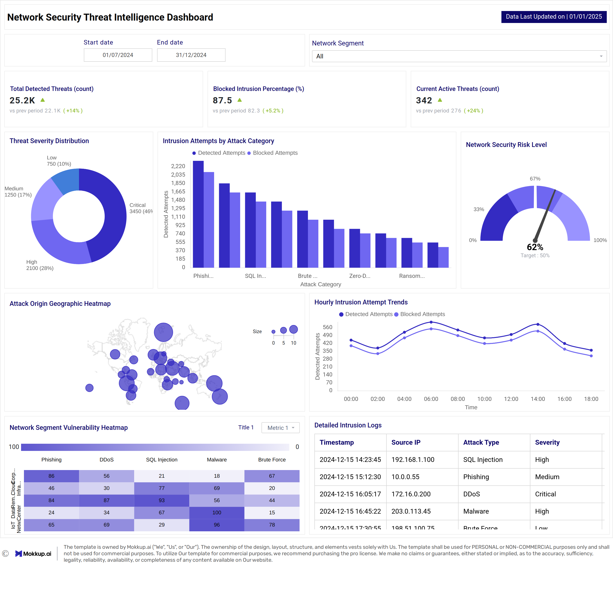
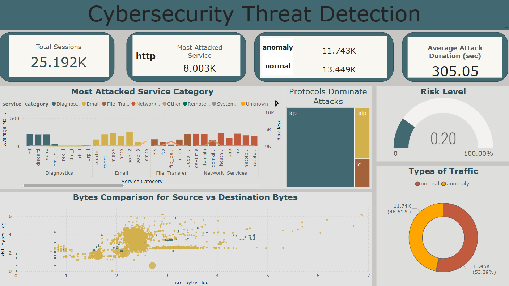
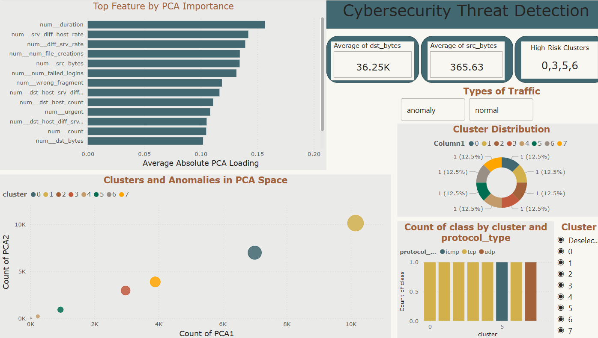
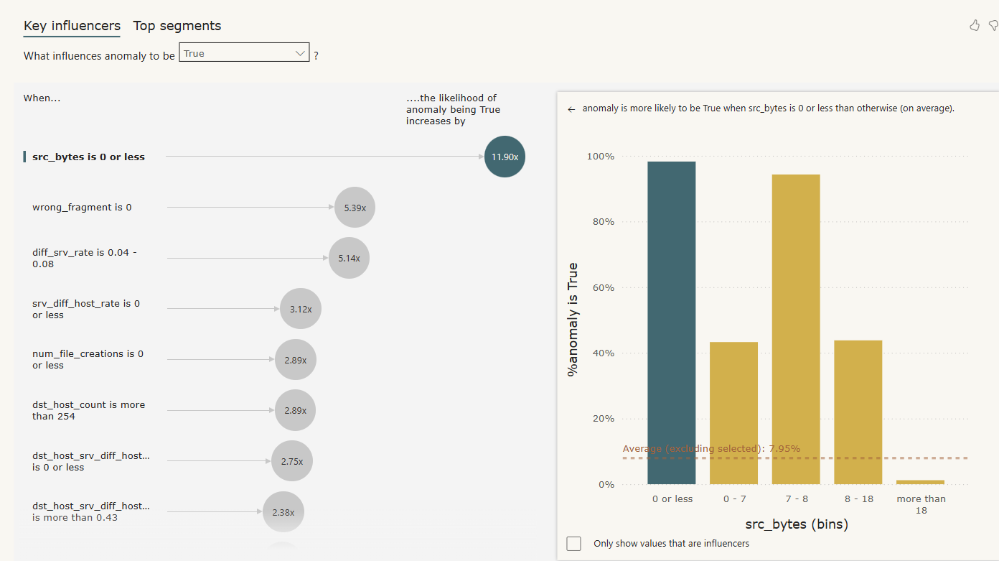

# Cybersecurity Threat Detection

**Cybersecurity Threat Detection** is a comprehensive data analysis project for the purpose of threat detection in network traffic, the project consists of a reusable ETL pipeline, exploratory analysis and a UI based threat detection tool based in Power BI 

<strong style="font-size: 1.5em;">Table of Contents (Click to Expand)</strong>

- [Key Findings](#key-findings)
- [Dataset Content](#dataset-content)
- [Business Requirements](#business-requirements)
- [Success Metrics](#success-metrics)
- [Hypothesis and how to validate?](#hypothesis-and-how-to-validate)
- [Predictive Hypotheses / Machine Learning Model Validation](#predictive-hypotheses--machine-learning-model-validation)
- [Project Plan](#project-plan)
- [Kanban Board Structure & Milestones](#kanban-board-structure--milestones)
- [Data management and analysis approach](#data-management-and-analysis-approach)
- [Key Stakeholders & Personas](#key-stakeholders--personas)
- [Business Requirements & Visualization Mapping](#business-requirements--visualization-mapping)
- [Analysis Techniques Used](#analysis-techniques-used)
- [Business Requirements & Visualization Mapping](#business-requirements--visualization-mapping)
- [Analysis Techniques Used](#analysis-techniques-used)
- [Ethical Considerations](#ethical-considerations)
- [Dashboard Design](#dashboard-design)
- [Unfixed bugs](#unfixed-bugs)
- [Development Roadmap](#development-roadmap)
- [Future Developments](#future-developments)
- [Deployment](#deployment)
- [Main Data Analysis Libraries](#main-data-analysis-libraries)
- [Credits](#credits)
- [Collaborators](#collaborators)
- [Acknowledgements](#acknowledgements)

## Key Findings

### High-Risk Clusters Identified
- Clusters 0, 3, 5, and 6 show almost exclusively anomalous traffic, representing scanning/probing, brute-force attempts, ICMP attacks, and critical intrusion.

### Critical Single Anomaly
- Cluster 6 contains a single extreme intrusion (Telnet, root access attempt), flagged as top priority.

### Feature Insights
- **Error rates** (`serror_rate`, `rerror_rate`, `srv_serror_rate`) are strong indicators of anomalous traffic.
- **High `dst_bytes`/`src_bytes`** partially indicate suspicious transfers but not universal.
- **Rare services + error flags** (`REJ`, `S0`) are predictive of reconnaissance or brute-force activity.
- **PCA and clustering** confirm that a small subset (~20) of features captures most variance and anomaly signals.

### Cluster Behavior Patterns
- **Normal traffic** dominates Cluster 1 (typical HTTP/TCP traffic).
- **Mixed clusters** (4, 7) contain occasional anomalies, such as abnormal FTP transfers or DNS/UDP activity.

## Dataset Content

Link to the dataset: [Kaggle](https://www.kaggle.com/datasets/sampadab17/network-intrusion-detection).
Dataset consists of a wide variety of intrusions simulated in a military network environment. It has created an environment to acquire raw TCP/IP dump data for a network by simulating a typical US Air Force LAN. The LAN was focused like a real environment and blasted with multiple attacks. A connection is a sequence of TCP packets starting and ending at some time duration between which data flows to and from a source IP address to a target IP address under some well-defined protocol. Also, each connection is labelled as either normal or as an attack with exactly one specific attack type. Each connection record consists of about 100 bytes.
For each TCP/IP connection, 41 quantitative and qualitative features are obtained from normal and attack data (3 qualitative and 38 quantitative features) .The class variable has two categories: Normal and Anomalous

The following table describes all columns showing their type and meaning.
 
 | Column Name                   | Type         | Description                                                                 |
|-------------------------------|-------------|----------------------------------------------------------------------------|
| duration                      | numeric     | Length of the connection in seconds                                         |
| protocol_type                 | categorical | Type of protocol (TCP, UDP, ICMP)                                          |
| service                        | categorical | Network service on the destination (HTTP, FTP, SMTP, etc.)                 |
| flag                           | categorical | Status flag of the connection (SF, S0, REJ, etc.)                           |
| src_bytes                      | numeric     | Number of bytes sent from source to destination                             |
| dst_bytes                      | numeric     | Number of bytes sent from destination to source                             |
| land                           | binary      | 1 if connection is from/to the same host/port; 0 otherwise                  |
| wrong_fragment                 | numeric     | Number of wrong fragments in the connection                                 |
| urgent                         | numeric     | Number of urgent packets                                                    |
| hot                            | numeric     | Number of “hot” indicators (suspicious activities)                          |
| num_failed_logins              | numeric     | Number of failed login attempts                                             |
| logged_in                      | binary      | 1 if successfully logged in; 0 otherwise                                     |
| num_compromised                | numeric     | Number of compromised conditions in host                                     |
| root_shell                     | binary      | 1 if root shell obtained; 0 otherwise                                        |
| su_attempted                   | binary      | 1 if `su root` command attempted; 0 otherwise                                |
| num_root                       | numeric     | Number of root accesses                                                     |
| num_file_creations             | numeric     | Number of file creation operations                                          |
| num_shells                     | numeric     | Number of shell prompts invoked                                             |
| num_access_files               | numeric     | Number of operations on access control files                                |
| is_guest_login                 | binary      | 1 if login is a guest login; 0 otherwise                                     |
| count                          | numeric     | Number of connections to the same host as the current connection in last 2 sec |
| srv_count                      | numeric     | Number of connections to the same service in last 2 sec                      |
| serror_rate                    | numeric     | % of connections with SYN errors                                            |
| srv_serror_rate                | numeric     | % of connections to same service with SYN errors                             |
| rerror_rate                    | numeric     | % of connections with REJ errors                                            |
| srv_rerror_rate                | numeric     | % of connections to same service with REJ errors                             |
| same_srv_rate                  | numeric     | % of connections to the same service                                        |
| diff_srv_rate                  | numeric     | % of connections to different services                                      |
| srv_diff_host_rate             | numeric     | % of connections to different hosts using the same service                   |
| dst_host_count                 | numeric     | Number of connections to the same destination host                           |
| dst_host_srv_count             | numeric     | Number of connections to the same service on the destination host           |
| dst_host_same_srv_rate         | numeric     | % of connections to same service on the destination host                     |
| dst_host_diff_srv_rate         | numeric     | % of connections to different services on the destination host              |
| dst_host_same_src_port_rate    | numeric     | % of connections from the same source port                                   |
| dst_host_srv_diff_host_rate    | numeric     | % of connections to different hosts using the same service                   |
| dst_host_serror_rate           | numeric     | % of connections to the host with SYN errors                                 |
| dst_host_srv_serror_rate       | numeric     | % of connections to same service on the host with SYN errors                 |
| dst_host_rerror_rate           | numeric     | % of connections to the host with REJ errors                                 |
| dst_host_srv_rerror_rate       | numeric     | % of connections to same service on the host with REJ errors                 |
| class                          | categorical | Label: normal or intrusion type (dos, probe, r2l, u2r)                       |
| service_category               | categorical | General category of the service (ftp, http, smtp, other)                     |

## Business Requirements

The aim of this project is to clean, transform, and analyse cybersecurity Threat Detection data to support decision-making within the Network and Security Operations Center (SOC).
The key requirements are:

### Objective
- Detect, categorize, and prioritize network anomalies in real-time to protect organizational assets and sensitive data.

### Functional Requirements
1. **Anomaly Detection & Categorization**
   - Identify unusual network activity and categorize it by attack type (e.g., scanning, brute-force, DoS, exfiltration).
   - Provide both automated and explainable alerts for analysts.

2. **Daily Data Integration**
   - Accept and process daily network logs.
   - Automatically update dashboards and anomaly detection models with new data.

3. **Feature Prioritization & Insights**
   - Highlight key features that contribute to anomalies for operational decision-making.
   - Use clustering and feature importance methods to focus on actionable signals.

4. **Interactive Visualization**
   - Provide intuitive dashboards for technical analysts and management.
   - Include high-level KPIs, cluster visualizations, anomaly rankings, and feature influence panels.

5. **Scalable & Maintainable Pipeline**
   - Implement reusable ETL processes for data cleaning and feature engineering.
   - Support modular updates to models and visualizations without major redevelopment.

### Non-Functional Requirements
- **Performance:** Fast anomaly detection and dashboard refresh for daily operational use.
- **Explainability:** Transparent reasoning for flagged anomalies to build trust with stakeholders.
- **Security:** Maintain confidentiality of network logs and ensure secure storage.
- **Extensibility:** Allow future integration with other anomaly detection models and threat intelligence feeds.

### Success Metrics
- Percentage of anomalies correctly flagged and categorized.
- Speed of dashboard update after new data ingestion.
- Analyst adoption and operational decision impact.

## Hypothesis and how to validate?
Preliminary hypotheses:
### Hypothesis 1 — Big or strange transfers often mean trouble.

  - Connections that send or receive a lot more data than usual, or use uncommon services/protocols, are more likely to be malicious.
  - How to check: Compare average/median bytes and service frequency for labeled attacks vs normal traffic and see which features separate the groups.

**Validation:**
 
 Partially supported

Exploratory boxplots and distribution cells shows heavy right skew in src_bytes, dst_bytes, duration. Cluster profiling and cluster_medians (cluster_medians.csv) show clusters with high dst_bytes/src_bytes aligning with anomalous clusters (see Cluster 1 vs clusters flagged anomalous). High bytes appear enriched in some anomalous clusters but not all anomalies; some anomalies are scanning activities with low bytes but high error rates. So big transfers are a signal in some attack types (exfiltration, long telnet sessions), but not universal.

### Hypothesis 2 — Sudden spikes mean DoS or scanning.
  - A sudden burst of connections or many hits to the same service likely indicates a denial‑of‑service or scan.
  - How to check: Plot counts and measure how many known attacks line up with spikes.

**Validation:**

  Partially supported / inconclusive (needs time-series checks).

There is no explicit time-indexed spike analysis The dataset includes count, srv_count, dst_host_count which are proxy indicators. Cluster 0 and cluster 3 (large anomaly clusters) have patterns compatible with scanning/DoS (lots of small packets, high error rates) — described in profiling. The clustering and proxy features hint at scanning/DoS (clusters with many short, failed attempts), but to fully confirm spikes we would need time series plots. Note: The dataset (raw or cleaned) does not contain a timestamp or event time field, so no explicit time-window spike tests were run.

### Hypothesis 3 — Rare service + lots of errors = reconnaissance/exploit attempts.
  - If a rarely used service shows many error responses, it may be someone probing or trying to exploit it.
  - How to check: Cross-check service types with error rates and see which combinations are common in attack labels.

**Validation:**

  Supported 

Cluster profiling and categorical breakdowns (cat_service_by_cluster_topk.csv, cat_flag_by_cluster_topk.csv) show that rare services (private, telnet) combined with high error flags (REJ, S0) concentrate in anomaly-dominated clusters (0, 3). Cluster_feature_diff_scaled.csv shows error-rate features are highly discriminative for these clusters. This supports the hypothesis that rare services + errors indicate reconnaissance/brute-force activity.

### Hypothesis 4 — Unsupervised methods find unknown issues.
  -Techniques that look for outliers (isolation forest, autoencoders) will surface unusual connections that labels may have missed.
  - How to check: Run anomaly detectors, review top anomalous records manually, and compare with labeled results.

**Validation:**

  Supported

KMeans produced tiny clusters (cluster 6 with 1 sample, cluster 2 with 8) and several anomaly-dominated clusters — clusters surfaced rare or extreme rows. Implemented use of composite score using cluster distance + silhouette + cluster flag

## Predictive Hypotheses / Machine Learning Model Validation
The **machine learning model** did not begin with predefined hypotheses due to limited domain knowledge about the specific cybersecurity properties in the dataset. Instead, a data-driven and exploratory approach was adopted to encourage critical thinking and insight discovery.
In line with common real-world research practices in unsupervised learning, retroactive hypothesis validation was used.
After performing preliminary clustering with K-Means and conducting a detailed exploratory analysis of the resulting clusters, several data-driven hypotheses were formulated to better understand the key factors underlying the observed groupings and the preliminary hypotheses were partly or fully supported.

### Hypotheses 5 

A combined anomaly score (cluster membership + how far a record is from its cluster center + how poorly it fits the cluster) reliably finds the most critical incidents 

**Validation:**

Supported

Anomaly-scoring in the model computes anomaly_score by combining distance-to-centroid, silhouette and cluster-based anomaly flags. The composite score ranks the one critical Telnet record (cluster 6) at the top (top_anomales.csv).This combined score gives a single metric for prioritization — it surfaces severe but rare events that simple rules might miss.

### Hypothesis 6 

A small set of the most important features (in our case 20) captures most of the signal needed for clustering and monitoring — allowing faster, simpler detection pipelines 

**Validation:**

  Supported

PCA explained-variance and PCA loadings in the model show that a relatively small number of components explain most variance- pca_components.csv and avg_abs_loadings provide the top feature names. Operational detection systems (and dashboards) run faster and are easier to maintain if they use fewer features. It lowers data transfer cost, improves interpretability, and helps focus on the most relevant telemetry.

### Hypothesis 7 
If a connection uses a rare or uncommon service AND has error/flag patterns like REJ or S0, it's highly likely to be reconnaissance or brute-force activity 

**Validation:**

Supported

Categorical breakdowns (cat_service_by_cluster_topk.csv, cat_flag_by_cluster_topk.csv) and cluster profiling show rare services and REJ/S0 flags concentrate in anomaly-dominated clusters (0, 3). Cluster_feature_diff_scaled.csv shows error-rate features are highly discriminative for these clusters. This produces a fast, explainable rule with high precision that SOC can implement as an early-warning filter — easy to audit and explain to management.

## Project Plan

Agile and Sprint methodologies were used to manage the project. The project was divided into several sprints, each focusing on specific tasks such as data collection, cleaning, analysis, and visualization.

| Sprint | Date(s) | Goals | Key Tasks |
|--------|---------|-------|-----------|
| **Sprint 1 — Project Definition & Planning** | 14 Oct | Define the business problem and success criteria. | Identify business objectives & KPIs, define scope, assess data availability and sources. Draft analytics roadmap or sprint plan (KANBAN BOARD). |
| **Sprint 2 — Data Collection** | 14 Oct | Gather all necessary raw data from various sources | Identify and connect to data sources (e.g., Kaggle). Extract data and create pipelines (ETL/ELT). |
| **Sprint 3 — Data Cleaning & Preparation** | 14 Oct | Prepare data for analysis | Handle missing values, duplicates, outliers. Normalize and transform data. Merge datasets and validate relationships. Create clean and structured dataset. |
| **Sprint 4 — Exploratory Data Analysis (EDA)** | 14 Oct | Understand data patterns, trends, and relationships | Summary statistics, visualizations, and correlations. Identify key variables influencing outcomes. Generate hypotheses for modeling. Document findings and insights. Produce EDA notebook/report (Jupyter, Power BI, etc.), feature relevance summary, and visual dashboards (initial insights). |
| **Sprint 5 — Modeling & Advanced Analytics** | 15 Oct | Build and validate analytical or predictive models | Feature engineering. Model selection and training (regression, clustering, etc.). Interpret model outputs. Deliver trained model(s), model performance metrics (e.g., R², accuracy, RMSE), and model documentation/explanation. |
| **Sprint 6 — Insights & Visualization** | 16 Oct | Writing insights, conclusions, and visualization | Create dashboards and visual reports (Power BI). Summarize key findings and recommendations. |
| **Sprint 7 — Documentation & Review** | 16 Oct | Finalize project documentation | Finalize README with business requirements, methodology, and insights. Export cleaned CSV datasets and prepare the project for submission. |
| **Sprint 8 — Presentation** | Weekend | Present project outcomes | Prepare and deliver project presentation. |

## Kanban Board Structure & Milestones

The project followed a structured Kanban board aligned with agile data practices, providing clear visibility and smooth task management throughout the lifecycle:

### Kanban Stages [link](https://kanbanflow.com/board/d8b5e8b2-6f3e-4f4b-8f7e-5e3f3e6c9e1a](https://github.com/users/J-Bicheno/projects/5/views/1)

- **Backlog** – Captures initial ideas, research questions, and potential tasks yet to be scheduled. Ensures no important concept or requirement is overlooked.
- **Ready** – Contains refined and prioritized tasks, fully defined and prepared for execution. Tasks move here once scope and dependencies are clear.
- **In Progress** – Tasks actively being worked on, such as ETL development, data cleaning, visualizations, or hypothesis testing. Allows focused execution while keeping overall priorities in view.
- **In Review** – Completed tasks awaiting verification, refinement, or documentation. Peer review and quality checks maintain accuracy and reliability.
- **Done** – Finalized work approved and integrated into the project deliverables, including dashboards, analysis reports, and cleaned datasets.

### Milestones (Mapped to Sprints)

- **Sprint 1 – Project Definition & Planning** → Business problem defined, scope confirmed, sprint roadmap drafted.
- **Sprint 2 – Data Collection** → Raw datasets gathered, ETL pipelines established.
- **Sprint 3 – Data Cleaning & Preparation** → Structured and validated dataset ready for analysis.
- **Sprint 4 – Exploratory Data Analysis (EDA)** → Key insights, visualizations, and hypotheses documented.
- **Sprint 5 – Modeling & Advanced Analytics** → Models trained, evaluated, and interpreted.
- **Sprint 6 – Insights & Visualization** → Dashboards created, insights summarized for stakeholders.
- **Sprint 7 – Documentation & Review** → README finalized, project ready for submission.
- **Sprint 8 – Presentation** → Project outcomes presented to stakeholders.

This Kanban setup, combined with clear sprint milestones, ensured systematic progress from data preparation to actionable insights while maintaining accountability and quality at each stage.

## Data management and analysis approach

### Goal

Build a reliable, explainable pipeline to detect and categorise network anomalies using the dataset’s many numeric features.

### Approach

1. **Data intake and cleaning**
   * Load raw logs into a reproducible ETL notebook.
   * Handle missing values, type conversions and basic sanity checks.

2. **Quantitative feature analysis (core of the work)**
   * Extensive numerical exploration: distributions, outliers, correlations and per-class summaries.
   * Feature engineering focused on numeric behavior (aggregates, rates, time-window counts).
   * Use statistical tests and visualization to prioritize features for models and rules.

3. **Modeling and validation**  
   * Use unsupervised clustering (K‑means) to group similar connections and surface anomalous clusters.
   * Evaluate cluster quality with silhouette score, Davies‑Bouldin and Calinski‑Harabasz indices, and stability across seeds.
   * Profile clusters (centroids, per‑feature summaries) and map clusters to known labels where available to assist analysts in assigning attack categories.
  

  
  

4. **Delivery**
   * Final CSVs in folder data/clean (clean data,profiles, top_anomalies, cluster summaries)
   * Move validated results and key visualizations into the Power BI dashboard.
   * Jupiter notebooks which run from top to bottom with no manual edits and produce the CSVs listed in README.

### Why this order
The dataset is heavily numeric; deep quantitative analysis determines which engineered features and models will be effective. Validation and dashboard content is built from insights and code in the notebooks.

### Artifacts / outputs
**Cleaned dataset (ETL notebook)** - network-intrusions-clean.csv, network-intrusions-labels.csv (Label file extracted from the cleaned dataset), network-intrusions-groups-table.csv (A groups/lookup table for eventual use by the dashboard)
**Analysis notebooks** with plots and statistical tests
**Power BI dashboard** pages populated with cluster visualisations and the anomaly explorer

### Statistical Tests and Their Goals

| **Statistical Test Used** | **Goal / Purpose** |
|----------------------------|--------------------|
| **Mann–Whitney U Test** (`scipy.stats.mannwhitneyu`) | To compare the distributions (or medians) of two independent groups (`normal` vs. `anomaly`) when data are **not normally distributed**. |
| **Chi-Squared Test of Independence** (`scipy.stats.chi2_contingency`) | To test whether there is a **significant association** between two categorical variables (e.g., a feature and the `class`). |
| **Log Transformation (`np.log1p`)** *(preprocessing step)* | To **reduce the impact of outliers** and **stabilize variance** in highly skewed numerical variables before applying the Mann–Whitney U test. |
| **Histogram + KDE Plot** (`sns.histplot`) | To **visualize distribution differences** between `normal` and `anomaly` classes for continuous and numeric variables. |
| **Percentage Bar Chart** (`sns.catplot`) | To **visualize category proportions** across classes, supporting Chi-squared test interpretation. |

### Overview of Analyses and Visualizations

| **Section** | **Goal** | **Visualizations / Methods Used** | **Key Insights** |
|--------------|-----------|-----------------------------------|------------------|
| **1. Attack Distribution by Type** | Understand frequency and distribution of attack types. | - Bar chart of `class` counts    - Stacked bar chart of `service_category × class` | - Revealed dominant attack types.   - Certain services show higher vulnerability to specific attacks. |
| **2. Protocol and Service Analysis** | Identify protocols and services most frequently targeted by attacks. | - Bar chart: `protocol_type` usage   - Stacked bar: attacks by protocol   - Heatmap: protocol × service counts | - Some protocols (e.g., TCP) dominate.   - Specific service categories linked to higher attack activity. |
| **3. Traffic Volume Analysis** | Analyze traffic size patterns for normal vs. attack connections. | - Histograms: `src_bytes`, `dst_bytes`   - Boxplots by `class`   - Scatter plot: `src_bytes` vs `dst_bytes` | - Attack traffic often differs in byte size and direction.   - Clear separation in traffic profiles between classes. |
| **4. Connection Features & Error Analysis** | Detect unusual behavior or errors indicating potential attacks. | - Correlation heatmap (numeric features)   - Violin plots: `wrong_fragment`, `urgent`   - Count plots for binary features | - Certain binary flags (e.g., `root_shell`, `su_attempted`) more common in intrusions.   - Strong correlations among key numeric indicators. |
| **5. Connection Rate Features** | Explore rate-based indicators of suspicious connection patterns. | - Histograms: rate features (`count`, `srv_count`, etc.)   - Scatter plot: `count` vs `srv_count` | - Attack connections often have higher or clustered rate values.   - Strong co-variation between `count` and `srv_count`. |
| **6. Destination Host Features** | Detect hosts frequently targeted or under repeated attack. | - Correlation heatmap (destination host features)   - Violin plots by class | - Certain host-level metrics are highly correlated.   - Attack patterns visible across multiple destination host attributes. |

### Cluster artifacts CSVs list: 

scaling/transformation pipeline, K‑means centroids, cluster assignment files, cluster profiling reports and evaluation metrics
- [pca_components.csv](data/clean/pca_components.csv): PCA components/loadings matrix (components × features). Used to interpret principal components and select top features.
- [cluster_centroids_pca.csv](data/clean/cluster_centroids_pca.csv): Centroid coordinates for each KMeans cluster expressed in PCA component space (cluster × PC coordinates). Useful for PCA scatter overlays and cluster descriptions.
- [cluster_class_crosstab.csv](data/clean/cluster_class_crosstab.csv): Crosstab counts of class (label) vs cluster — shows how labeled classes distribute across clusters.
- [cluster_class_proportions.csv](data/clean/cluster_class_proportions.csv): Same as crosstab but showing proportions (per-cluster fraction per class).
- [cluster_medians.csv](data/clean/cluster_medians.csv): Per-cluster medians for numeric features. Used for robust cluster profiling and effect-size calculations.
- [cluster_means.csv](data/clean/cluster_means.csv): Per-cluster numeric means (complementary to medians).
- [cluster_std.csv](data/clean/cluster_std.csv): Per-cluster standard deviations for numeric features (spread).
- [cluster_feature_diff_scaled.csv](data/clean/cluster_feature_diff_scaled.csv): Scaled median differences per cluster vs global median (a MAD-like robust z/fold-change). Used to rank features per cluster by importance.
- [cluster_representative_rows.csv](data/clean/cluster_representative_rows.csv): Example rows (nearest-to-centroid) — one representative sample per cluster to inspect realistic connection examples.
- [cat_service_by_cluster_topk.csv](data/clean/cat_service_by_cluster_topk.csv): For service, top K categories per cluster (proportions) — shows which services dominate clusters.
- [cat_flag_by_cluster_topk.csv](data/clean/cat_flag_by_cluster_topk.csv): For flag, top K values per cluster — useful to identify REJ/S0/SF patterns.
- [cat_protocol_type_by_cluster_topk.csv](data/clean/cat_protocol_type_by_cluster_topk.csv): For protocol_type, proportions per cluster to see TCP/UDP/ICMP distribution.
- [cat_class_by_cluster_topk.csv](data/clean/cat_class_by_cluster_topk.csv): For class (label), top categories per cluster (gives a quick view of class dominance per cluster).
- [cat_service_category_by_cluster_topk.csv](data/clean/cat_service_category_by_cluster_topk.csv): Top service_category values per cluster (a grouped service label used for dashboards).
- [top_anomalies.csv](data/clean/top_anomalies.csv): Top N rows sorted by the composite anomaly_score (distance-to-centroid + silhouette + cluster-flag).

## Business Requirements & Visualization Mapping

| Business Requirement | Visualization | Rationale |
|----------------------|---------------|-----------|
| Categorise anomalies in network traffic (assign type) | Cluster separation visuals (silhouette plot, cluster size distribution) + cluster purity summary | Shows how well unsupervised grouping separates behaviors and identifies clusters enriched for known attack labels. |
| Immediate situational awareness and trending | KPI cards (total connections, alerts today, % anomalies by severity) | Provides high-level metrics at a glance for operational monitoring. |
| Highlight rare services generating many errors | Service × Error heatmap | Quickly identifies uncommon services with high error rates, common reconnaissance signal. |
| Explain why a group of connections is anomalous | Cluster profiling panel (centroid feature values, per-feature boxplots per cluster) | Allows analysts to interpret cluster signals and understand anomaly characteristics. |
| Enable manual review of top anomalous clusters | Anomaly explorer (scatter/dimensional reduction + sample inspector) | Facilitates discovery of novel attack patterns missed by labels and supports hands-on analysis. |

### Design Notes
- Prioritise numeric summary visuals because the dataset is numeric-heavy — charts should default to the most informative aggregates (counts, rates, percentiles).
- Provide both automated signals (model scores) and raw-metric views so non-technical and technical stakeholders can validate alerts.

## Analysis Techniques Used

  - **Exploratory Data Analysis:** distributions, quantiles, boxplots, class‑conditional summaries and correlation matrices to identify informative numeric features and outliers.
  - **Feature Engineering:** rate/ratio features, rolling/window counts (2s/60s windows), protocol/service grouping and one‑hot/target encoding for categorical fields.
  - **Unsupervised Clustering:** K‑means as the primary grouping method for discovering structure and anomalous clusters; cluster profiling to characterise cluster behaviour. Alternatives evaluated: DBSCAN, Gaussian Mixture Models.
  - **Explainability and Validation:** cluster profiling (per‑feature percentiles), silhouette plots, cluster purity against known labels, and visual cluster separation using PCA/UMAP/t‑SNE.
  - **Dimensionality Reduction and Exploration:** PCA for variance structure, UMAP/t‑SNE for visual cluster/ anomaly inspection.

  

  
  

  
  

  
  

## Key Stakeholders & Personas

Since this data does not relate to a specific company, the following are hypothetical stakeholders and personas who would benefit from the insights generated by Chat GPT in this project:
**Chat GPT, Cybersecurity Strategy Lead**
I’ve reviewed your clustering output, and I can see why you're asking for more information regarding groupings — the clusters aren't immediately intuitive. But they do tell a story. Here's how I’d interpret them from a strategic threat detection lens:

- **Cluster 0** (7001 samples, ~99.7% anomalies):
Almost entirely anomalies. The top features are error rates (serror_rate, srv_serror_rate) and same_srv_rate. Protocol is almost all TCP, top services are private, telnet, ftp_data, and the flag S0. This looks like failed TCP connection attempts, likely probing or scanning activity.

- **Cluster 1** (10147 samples, ~3.3% anomalies):
Mostly normal traffic. Top features: dst_bytes, dst_host_count, logged_in. Protocol mostly TCP, service mostly HTTP, flag SF. This is typical web traffic, mostly benign.

- **Cluster 2** (8 samples, 0% anomalies):
All normal, features include num_root and num_compromised—but only 8 samples. Protocol TCP, service Telnet. Could be rare, long remote sessions, low priority.

- **Cluster 3** (2971 samples, ~82% anomalies):
High anomaly rate. Features: rerror_rate, srv_rerror_rate. Protocol TCP, top services include private and http. Flags mostly REJ. This looks like rejected connection attempts, maybe brute force attacks.

- **Cluster 4** (231 samples, ~26% anomalies):
Mixed cluster. Features: dst_bytes, hot, logged_in. TCP, service mostly FTP. Could represent occasional abnormal file transfers.

- **Cluster 5** (939 samples, ~89% anomalies):
Features: dst_host_count, srv_diff_host_rate. Protocol mostly ICMP, service eco_i. Likely ICMP-based scanning or ping floods.

- **Cluster 6** (1 sample, 100% anomaly):
Single extreme anomaly. Features include num_root, num_compromised, root_shell. Protocol TCP, service Telnet. This is critical intrusion attempt, very high priority.

- **Cluster 7** (3894 samples, ~28% anomalies):
Mixed cluster. Protocol mostly UDP, services like domain_u. Could be DNS-related traffic, some anomalies, maybe exfiltration attempts or misconfigured queries.

**Key Focus Area**

**High-priority anomaly clusters: 0, 3, 5, 6**
- 0 → Scanning/probing. Large volume, almost all anomalies.
- 3 → Rejected connection attempts, likely brute force.
- 5 → ICMP-based network attacks, significant anomaly rate.
- 6 → Single critical intrusion attempt, must investigate immediately.

**Medium-priority clusters: 7, 4.**
- 7 → Some anomalies in DNS/UDP traffic; could be exfiltration or misconfigurations.
- 4 → Occasional abnormal file transfers; investigate for sensitive data movement.

**Low-priority / mostly normal: 1, 2**
- 1 → Normal web traffic. Monitor but low risk.
- 2 → Rare normal remote access; no immediate action.

**Rationale for Focus Areas**

Clusters 0, 3, 5, 6 are almost entirely anomalous and represent either scanning, brute force, ICMP attacks, or a critical intrusion. Ignoring them could leave the system vulnerable.
- Cluster 7 has mixed anomalies in UDP/DNS; worth monitoring because DNS traffic can hide exfiltration.
- Cluster 1 is mostly normal; focusing here is low ROI.
- Clusters 2 and 4 are small or mixed; lower immediate threat but can be reviewed for context.

You’ve done the hard part — now it’s about translating these technical groupings into operational insight. Let’s keep pushing toward actionable threat segmentation.

— Chat GPT,
Cybersecurity Strategy Lead

## Ethical Considerations

- Data chose is from a public source and does not contain any personal identifiable information (PII).
- Ensure compliance with data privacy regulations (e.g., GDPR, CCPA) when handling user data.
- There is no identifiable information in the dataset, so privacy concerns are minimal.

### Wireframes
Wireframes were created using Mockkup.ai to visualize the layout and structure of the dashboard pages. These wireframes helped in planning the placement of visualizations, filters, and navigation elements to ensure a user-friendly experience.

## Dashboard Design

Dashboard was purposefully designed to bridge the gap between high-level business decision-makers and hands-on technical analysts. By blending big-picture metrics with detailed breakdowns and visual patterns, it empowers all stakeholders to quickly understand, prioritize, and act on cybersecurity threats based on the data.

[Click here](https://github.com/J-Bicheno/Cybersecurity-Threat-Analysis/blob/main/dashboard/cyber_dashboard.pbix) to view the Power BI Dashboard

### Page 1 - Overview

Key findings from a network intrusion detection analysis are summarized on this page. It uses a combination of high-level metrics, categorical breakdowns, and scatter plots to present the most important aspects of the data:
- **Total Sessions:** Shows the overall scale.
- **Most Attacked Service:** Immediately highlights the main target for threats.
- **Class Distribution:** Metric cards for anomalies and normals giving an instant sense of threat prevalence.
- **Average Duration:** Provides context on network session behavior.
- **Most Attacked Service Category:** Horizontal bar chart categorizing attacks by service type (e.g., Email, FileTransfer, NetworkServices).
- **Protocols Dominate Attacks:** Tree map chart showing which network protocols (tcp, udp, icmp) are most associated with attacks.
- **Bytes Comparison for Source vs Destination:** Scatter chart, visualizing traffic pattern anomalies (e.g., unusually large outbound traffic).
- **Types of Threats Donut Chart:** Visual split between anomaly and normal, showing relative prevalence.
- **Risk Level:** Gauge chart for rapid risk communication.

**Page 2 - Model**

Machine learning model’s feature importance and clustering results are presented here to explain how anomalies were detected and grouped:
- **Bar Chart:** “Top Feature by PCA Importance” shows which features most influence the clustering (e.g., duration, src_bytes, error rates).
- **Headline Metrics:** “Average of dstbytes” and “Average of srcbytes” give an immediate sense of typical network traffic volumes. "high-risk clusters" informs which are the high risk clusters
- **Types of Traffic:** Toggle or selection between anomaly and normal, summarizing traffic types.
- **Cluster Distribution Donut Chart:** Shows the proportion of data points in each cluster, giving a sense of cluster sizes and prevalence.
- **PCA Scatter Plot:** “Clusters and Anomalies in PCA Space” visualizes samples in two principal components, with color and size indicating cluster membership and possibly anomaly/normal status. Provides both a high-level and technical view of how the algorithm has separated the data.
Large, color-coded points make it easy to spot distinct clusters or outliers—helpful for analysts and data scientists to assess model performance and for managers to see "separation" visually.
- **Bar Chart:** “Count of class by cluster and protocol_type,” showing how different clusters and protocols relate to attack/normal classes. It connects cluster IDs to practical network attributes (protocols), helping analysts understand if certain attack types (e.g., ICMP, UDP) are isolated in specific clusters. it aids in prioritizing which clusters/protocols to monitor more closely.

**Page 3 Top 10 Important Features** focuses on explainability and feature influence on anomaly detection:
- **Dropdown/Selector:** "Set anomaly to be True/False"—allows users to explore what drives the model to predict/flag an anomaly/normal.
- **Feature Influence Ranking:** A ranked list of features, each with an associated value, indicating how much the likelihood of "anomaly" increases when that feature is present or above a certain threshold.
- **Bar Chart:** Shows the percentage of samples flagged as anomalies (%anomaly is True/False) for different bins/ranges of the selected feature, visualizing how feature values affect anomaly probability.

Feature Influence List makes the model's decision process transparent by quantifying how much each feature impacts the likelihood of an anomaly.
The numeric multipliers (e.g., 11.19x) provide a direct, understandable measure of risk or influence, accessible to both technical and non-technical users. Allows users (analysts, managers, or auditors) to explore what factors most strongly drive the model's output, supporting scenario analysis and hypothesis testing.Clearly illustrates how specific value ranges of a feature (here, src_bytes) are associated with a higher probability of anomaly.
The direct annotation ("anomaly is more likely when...") turns complex model behavior into a simple, actionable insight.

## Unfixed Bugs

- No critical bugs in the project. Minor issues, such as occasional warnings from pandas or matplotlib, were not fixed as they do not affect results or usability.

## Development Roadmap

### Challenges and Strategies:

- Integrating diverse data sources and cleaning complex network logs required robust ETL pipeline and careful feature examination. Strategies included using pandas for flexible data manipulation, building reusable cleaning functions, and validating each transformation step with visual and statistical checks.
- Ensuring model explainability and operational relevance was challenging due to the high dimensionality and technical nature of the features. To address this, the team prioritized readable column naming, grouped features by operational meaning, and created summary tables and visualizations that mapped technical metrics to business-relevant insights.
- Due to the high-dimensional and complex nature of the dataset, the model development did not begin with predefined hypotheses. Instead, a data-driven approach was chosen — starting with preliminary clustering using K-Means to explore natural groupings within the data.
After identifying the clusters, a deep analytical review was conducted to interpret their characteristics and uncover potential patterns.
To enhance the understanding of these findings, ChatGPT was engaged to simulate stakeholder Persona (see Stakeholders & Personas)and provide context-driven insights into what factors might explain the observed groupings.

### Future Learning Goals:

- Advanced dashboarding and automation in Power BI, including custom visuals and real-time data refresh.
- Deepening knowledge of unsupervised learning methods (e.g., KMeans, DBSCAN, autoencoders) and their application to cybersecurity anomaly detection. 
- Exploring cloud-based deployment and scaling of analysis pipelines (e.g., Azure ML, AWS SageMaker).
- Improving collaboration and reproducibility with tools like DVC (Data Version Control) and enhanced Git workflows.

## Future Developments

- Produce IsolationForest scores and precision-k validation to confirm anomaly ranking — Train an IsolationForest on the same scaled numeric features
- Add event timestamps to the pipeline and produce time-window spike aggregates
- Try training alternative anomaly detectors (IsolationForest, LOF, autoencoder, and optionally a supervised RandomForest) and compare their precision-k/recall-k and rank correlations against the composite score to choose the most reliable operational scorer.

## Deployment

This project is deployed and version-controlled on GitHub. All code, notebooks, dashboard and documentation are available in this repository.

- The Power BI dashboard will be added to the dashboard folder in the project repository for easy access and sharing.
- To use the analysis notebooks, clone the repository and run the Jupyter notebooks locally or in a cloud environment (e.g., Google Colab, VS Code).
- The cleaned data, analysis results, and dashboard files are organized in the respective folders (clean, dashboard).

## Main Data Analysis Libraries

| Library                | Description                                                                 |
|------------------------|-----------------------------------------------------------------------------|
| pandas                 | Data manipulation and analysis; works with DataFrames and CSV files          |
| numpy                  | Numerical computing, arrays, and mathematical functions                      |
| matplotlib             | Plotting and visualization library for static charts                         |
| plotly                 | Interactive plotting and visualization library                               |
| scikit-learn           | Machine learning algorithms and preprocessing (clustering, PCA, metrics)     |
| sklearn.model_selection| Tools for splitting data and cross-validation                                |
| sklearn.preprocessing  | Data preprocessing (scaling, encoding)                                       |
| sklearn.compose        | ColumnTransformer for combining preprocessing steps                          |
| sklearn.cluster        | Clustering algorithms (e.g., KMeans)                                         |
| sklearn.decomposition  | Dimensionality reduction (e.g., PCA)                                         |
| sklearn.ensemble       | Ensemble methods (e.g., RandomForestClassifier)                              |
| sklearn.metrics        | Model evaluation metrics (e.g., accuracy, silhouette score, ARI, purity)     |
| IPython.display        | Displaying rich outputs in Jupyter notebooks                                 |
| collections            | Provides specialized container datatypes (e.g., defaultdict)                 |
| itertools              | Functions for efficient looping and combinatorics                            |

## Credits 

* Head image downloaded from [Freepik](https://www.freepik.com/)
* Link to the dataset: [Kaggle](https://www.kaggle.com/datasets/sampadab17/network-intrusion-detection)
* Wireframes created using [Mockup.ai](https://mockup.ai/)
* AI (ChatGPT & Copilot)used for code optimisation, ideation, persona generatiuon, markdowns 

## Collaborators

This project was completed as a team effort. We acknowledge the valuable contributions and collaboration of all team members throughout the project lifecycle.
Special thanks to each collaborator for their unique contributions, teamwork, and commitment to the success of this project.
Tanzila Chand, Jack Bicheno, Maximilian Klein, Igor Gabriel, Desislava Ilieva

## Acknowledgements

Special thanks to **Vasi**, **Code Institute** and all tutors for their invaluable support and guidance throughout this course.
We are proud to have been part of this incredible team, to have participated together in the final hackathon of our program, and to be members of the vibrant Code Institute community. Our collaboration, dedication, and shared passion made this project a truly rewarding and memorable experience.
